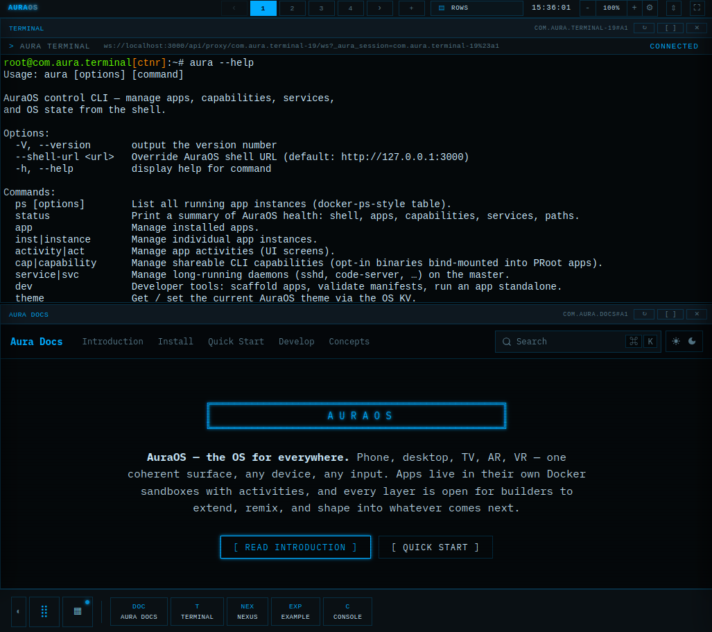

# AuraOS

> **AuraOS — the OS for everywhere.** Phone, desktop, TV, AR, VR — one
> coherent surface, any device, any input. Apps live in their own Docker
> sandboxes with activities, and every layer is open for builders to
> extend, remix, and shape into whatever comes next.



> [!WARNING]
> **Pre-alpha — not for production use.**
> Every service runs in dev mode by default: no authentication, no TLS,
> no hardened sandbox, APIs fully exposed on localhost. This is intentional
> for the current development stage. Do **not** expose port 3000 to a public
> network or run untrusted apps inside the OS yet.

---

## What it is

A browser-based WebOS that runs inside one Docker container. The shell
draws the desktop — status bar, dock, launcher, layout manager, process
manager — and every app you launch boots inside its own sandbox (PRoot
or full container) and is rendered in an iframe.

The shell talks to apps only through the reverse proxy at
`/api/proxy/<id>/<path>`. Apps never reach the browser directly; the
proxy injects identity headers, theme tokens, a console relay, and a
keystroke forwarder on the way in.

```
                       ┌──────────────────────────┐
                       │       Browser            │
                       │  ┌────────────────────┐  │
                       │  │  iframe per app    │  │
                       │  └────────────────────┘  │
                       └────────────┬─────────────┘
                                    │ http://shell:3000
                                    ▼
   ┌──────────────────────────────────────────────────────────┐
   │  aura-shell  (Astro SSR + AppManager + event bus)        │
   │                                                          │
   │  /api/proxy/<id>/<path>  ──────► HTML rewrites, meta,    │
   │                                  console relay, keys      │
   │  /api/data/<authority>/* ──────► content-provider router  │
   │  /api/apps, /api/nexus/* ──────► lifecycle, install       │
   └────────────┬────────────────────────────┬────────────────┘
                │                            │
                ▼                            ▼
   ┌────────────────────────┐    ┌───────────────────────────┐
   │  PRoot sandbox         │    │  Docker sibling container │
   │  apps/<id>             │    │  aura-<id>                │
   │  Astro / raw runtime   │    │  full kernel namespaces   │
   └────────────────────────┘    └───────────────────────────┘
```

The shell is one process. Apps are many — each one its own dev server
listening on its own port, reached only through the proxy.

## Why

- **Per-app isolation without per-app VMs.** PRoot keeps the spawn cost
  at a few ms; container mode adds real kernel namespaces when you need
  them. One manifest field flips between the two.
- **One SDK across every app.** Lifecycle hooks, content providers,
  keymap actions, intents, themes — all the same surface, whether the
  app is Astro, Next.js, or anything else that speaks HTTP.
- **Open at every layer.** Shell, SDK, apps, CLI, distribution layer —
  all in this repo, all changeable, all documented.

## Quick start

```bash
git clone https://github.com/lacky95/auraos.git
cd auraos
docker compose up
```

Open `http://localhost:3000` — the desktop comes up in a few seconds
after the first build (which itself takes a couple of minutes). The
launcher (`Ctrl+Alt+Space`) lists the bundled apps; the Terminal,
Console, Notepad, Counter, Settings, Nexus and Docs apps are working
references for every pattern in the OS.

## Documentation

The full docs live in the **Docs** app inside the OS itself
(`apps/com.aura.docs/`). Open it from the launcher once AuraOS is
running. Or browse the markdown source under
`apps/com.aura.docs/fumadocs-site/content/docs/`:

- **Introduction** — what AuraOS is, the architecture diagram, the
  shapes of the system.
- **Installation** & **Quick Start** — get running; the first 90
  seconds inside the OS.
- **Develop an App** — `aura dev new`, manifest fields, lifecycle
  hooks, activity mode.
- **Develop in the Sandbox** — `aura jump` + Claude Code from inside a
  running app.
- **Core Concepts** — instance vs activity, runtime modes, sandbox
  modes, proxy, theme, keymap, intents.
- **SDK Reference** — every namespace on `osClient`.
- **CLI Reference** — every `aura …` command.
- **Nexus** — the distribution layer (install / update / publish from
  Git, OCI, curated index, or local paths).
- **Troubleshooting** — common dev issues with concrete fixes.

## Repo layout

```
packages/core         AppManager, ProotRunner, ContainerRunner,
                      OsEventBus, PermissionManager, ThemeManager,
                      Nexus pipeline, manifest schema.
packages/shell        Astro SSR shell — /api/proxy, /api/data,
                      /api/apps, /api/nexus, status bar, dock,
                      launcher, layout manager, process manager.
packages/app-sdk      OsClient, lifecycle factories, runtime adapters
                      (Astro + Next.js), proxy helpers.
packages/aura-cli     The `aura` CLI used inside and outside the OS.
packages/ui           Shared UI primitives (@aura/ui).
apps/<id>             Reference apps:
                      • com.aura.terminal  WS + PTY, multicast sessions
                      • com.aura.notepad   multi-activity shared state
                      • com.aura.counter   multi-instance × multi-activity
                      • com.aura.settings  KV-backed prefs UI
                      • com.aura.console   WS persistence + log feed
                      • com.aura.nexus     install / publish GUI
                      • com.aura.docs      Next.js raw runtime — this site
```

## License

[Apache License 2.0](LICENSE) — Copyright 2026 Lukas Lakner.

## Updating

AuraOS updates itself. In **Settings → About**, `Update AuraOS` first runs a
quick check in the running shell — is there a newer commit on `main`, and is
the working tree clean — and only then, on confirmation, hands the work to a
detached updater container that rebases, rebuilds the image and recreates the
shell.

The updater is a separate container by necessity: the rebuild recreates
`aura-shell`, so anything running inside it would be killed mid-update. It
writes progress to a job file on the app-data volume, which is how the new
shell reports on work its predecessor started — including the full build
transcript behind *Show full log*.

A first boot after a rebuild installs dependencies and builds every package,
so several minutes is normal. The updater treats a container that is still
producing output as progress and keeps waiting; a rollback needs the new
shell to go silent and unresponsive, not merely to be slow.

Nothing has to be installed for this to work: the compose plugin ships in the
image, and an older image downloads it on the fly.
