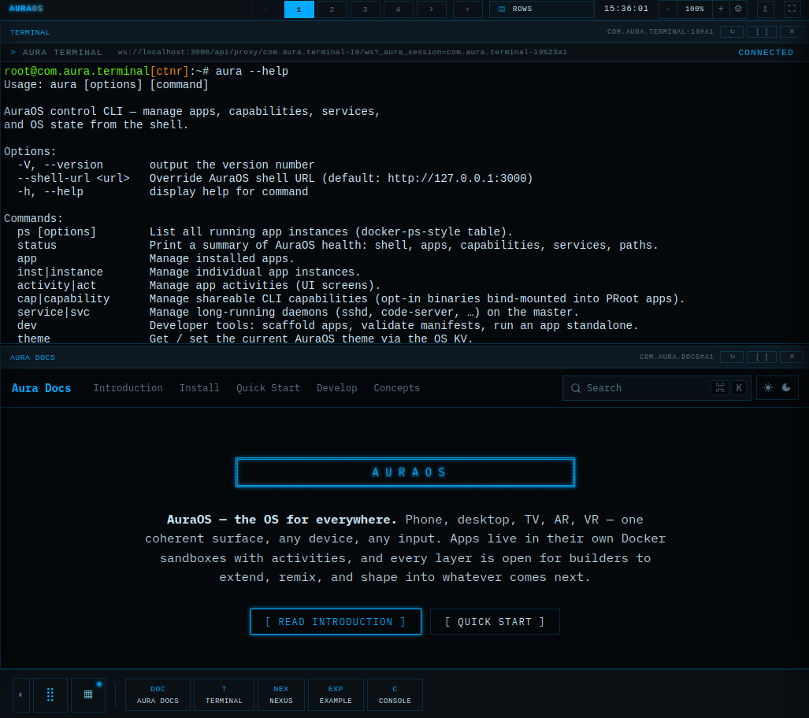

# AuraOS

> **The WebOS for humans and their agents.**
> Created with agents, curated by humans.

A self-hosted WebOS where people and AI agents work side by side. Every tool
and agent runs sandboxed in its own container, installs like an app, and snaps
together like building blocks — visible in one transparent control plane.

**Start with one container — and let it grow from inside.**

**Self-hosted · Sandboxed · Open source (Apache 2.0)** —
[aura.lakner.io](https://aura.lakner.io) ·
[Docs](https://docs.aura.lakner.io) ·
[Store](https://github.com/lacky95/auraos-store)



> [!WARNING]
> **Pre-alpha — not for production use.**
> Every service runs in dev mode by default: no authentication, no TLS, APIs
> fully exposed on localhost. Do **not** expose port 3000 to a public network
> or run untrusted apps inside the OS yet.

---

## What AuraOS is

AuraOS is one Docker container that becomes your whole workspace. You open it
in the browser and get a desktop — launcher, dock, windows, workspaces, a
process manager — where every window is an app running in its own sandbox.

Anything can become an app: a classic tool (Trilium, VS Code, Guacamole, a
browser), a service (Whisper, LiteLLM, Postgres, an OCI registry), or an
AI agent (Claude Code, Codex, Hermes). A thin adapter wraps the upstream image
unchanged, the OS gives it scoped capabilities and a place in the UI, and from
then on humans and agents use it side by side.

The OS doesn't sit in the middle of that traffic. It is the **phone book**:
apps declare what they *provide* and *consume* — REST, MCP, WebSocket, events,
KV — in the Interface Registry. Agents look them up and connect directly. Add a
note-taking app that serves an MCP, and every agent on the desk can read and
write the same notes you do.

### Why it exists

Tools, models and agents each live in their own silo, and connecting them
means custom glue: auth, ports and YAML. Capable agents now exist, but they
either run with full access to everything or stay inside one vendor's cloud.
AuraOS is a self-hosted, sandboxed and supervised home for both people and
agents. Every piece of it is replaceable.

> Don't like an app? Rebuild it. Don't trust a model? Swap it. Outgrew an
> agent? Replace it.

## What works today

- **Isolation by default.** Each app runs in its own container (or a
  lightweight PRoot sandbox) and sees only its own slice of the filesystem and
  the tools it was granted.
- **Capabilities.** Host tools — `claude`, `codex`, `docker`, `git`, `node`, … —
  are installed once and granted per app. Your AI coding agent is just another
  capability.
- **Wrap any container image.** Apps declare sidecars; the upstream image
  stays untouched, so upgrades are still `docker pull`.
- **Interface Registry.** Apps register REST / MCP / WebSocket / event / KV
  interfaces; agents discover them through the registry (itself served as an
  MCP).
- **Built-in MCP servers.** Agents can drive the shell UI (`aurashelld`),
  every terminal session, Notepad, the docs and the Interface Registry.
- **Aura Context.** One OS-wide store for env vars, secrets and shared volumes,
  injected into the apps that need them.
- **Nexus, the app store.** Install, update and publish from Git, an OCI
  registry, the [official catalogue](https://github.com/lacky95/auraos-store)
  or a local path — into system, global or user scope.
- **One CLI, inside and out.** The same `aura` runs on the host and inside
  every sandbox: `aura dev new` scaffolds an app, `aura jump` drops you into a
  running one, `aura mount` attaches another app's files live.
- **Self-update.** Settings → About pulls, rebuilds and restarts the OS.

## Built with agents, curated by humans

AuraOS is developed inside AuraOS. Claude Code runs as a capability in a
terminal or app sandbox, mounts the app it's working on with `aura mount`,
reads the Aura docs MCP before touching anything, and commits back to this
repo. Plans and tasks live in a wrapped Trilium app that serves as shared
memory for the human and several agents. Agents check UI changes through a
wrapped browser (Steel) over MCP.

The same desk also runs real day-to-day work: a remote desktop exposed over
MCP, and a voice agent that hands tasks to a long-running Hermes agent. Each
of these started as a real need, and each one hardened the OS.

The agents do the work; a human reviews and keeps the leash.

## Principles

- **Registry, not bus.** The OS connects things, then gets out of the data path.
- **Sandbox everything.** Isolation and scoped capabilities are the default.
- **Extend, never fork.** Thin adapters over unchanged upstream tools.
- **Legibility over gloss.** The UI is the system's X-ray — show the machine.
- **Depth first.** Real apps harden the OS; breadth waits for a real need.
- **Human in the loop.** Agents do the work; humans keep the leash.

## Quick start

```bash
git clone https://github.com/lacky95/auraos.git
cd auraos
docker compose up
```

Docker is the only dependency. Open `http://localhost:3000`. The first build
takes a few minutes; after that the desktop comes up in seconds. Press
`Ctrl+Alt+Space` for the launcher.

## How it fits together

```
   Browser ── one iframe per app window
      │
      ▼  http://localhost:3000
   ┌──────────────────────────────────────────────────────────────┐
   │ aura-shell  (Astro SSR · AppManager · event bus · KV)        │
   │                                                              │
   │  /api/proxy/<id>/*   reverse proxy: identity, theme, console │
   │  /api/interfaces     Interface Registry (provides/consumes)  │
   │  /api/apps, /nexus   lifecycle, install, update, publish     │
   │  Context             env · secrets · volumes                 │
   └──────────────┬───────────────────────────────┬───────────────┘
                  ▼                               ▼
   ┌──────────────────────────┐    ┌──────────────────────────────┐
   │ app container  aura-<id> │    │ sidecars  aura-<id>--<svc>   │
   │ granted tools + /data    │    │ upstream images, unchanged   │
   └──────────────────────────┘    └──────────────────────────────┘
```

The browser never talks to an app directly: every request goes through the
shell's proxy. Agents look up interfaces in the registry and then connect
straight to the app.

## Documentation

Full docs at **[docs.aura.lakner.io](https://docs.aura.lakner.io)**. They
also ship inside the OS as the Docs app, and agents can read them over MCP.
They cover installation, developing and publishing apps, the sandbox
workflow, core concepts, Context, Interfaces, sidecars, cross-app mounts,
Nexus, and the SDK and CLI references.

## Repo layout

```
packages/core       AppManager, container/PRoot runners, Interface Registry,
                    Context, Nexus, permissions, scopes, updater
packages/shell      the desktop and every /api route
packages/app-sdk    OsClient, lifecycle handlers, runtime adapters
packages/aura-cli   the `aura` CLI (host + inside every sandbox)
packages/ui         shared UI components (@aura/ui)
packages/kv-store   OS key-value store (Valkey)
apps/               system and reference apps — Terminal, Console, Notepad,
                    Settings, Nexus, Docs, Browser, Whisper, registry,
                    aurashelld, Counter, Example
landing/            aura.lakner.io
```

## Where we're going

- **Agents as first-class objects:** task agents and long-running resident
  agents, each with its own identity, grants, audit trail and take-over.
- **On-demand activation:** start a provider when someone connects to it.
- **Permission enforcement** between interface consumers and providers.
- **Ambient, adaptive UI:** an interface that adapts to your attention —
  minimal on AR glasses while you walk, a full desktop when you sit down.
- **A central station for shipping software:** build once, ship as a
  sandboxed app, install anywhere with one command.

## License

[Apache License 2.0](LICENSE) — Copyright 2026 Lukas Lakner.
